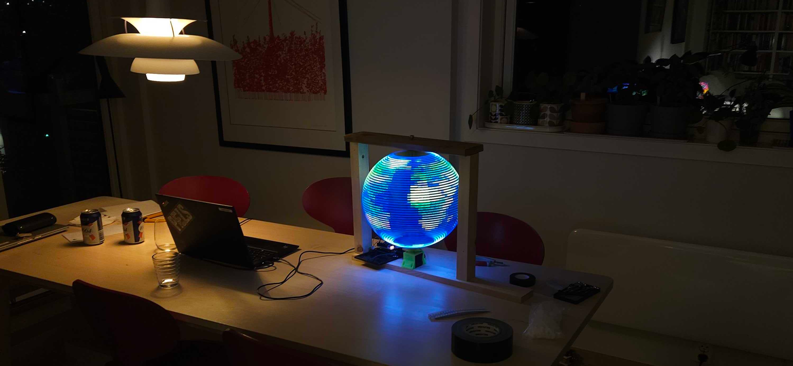
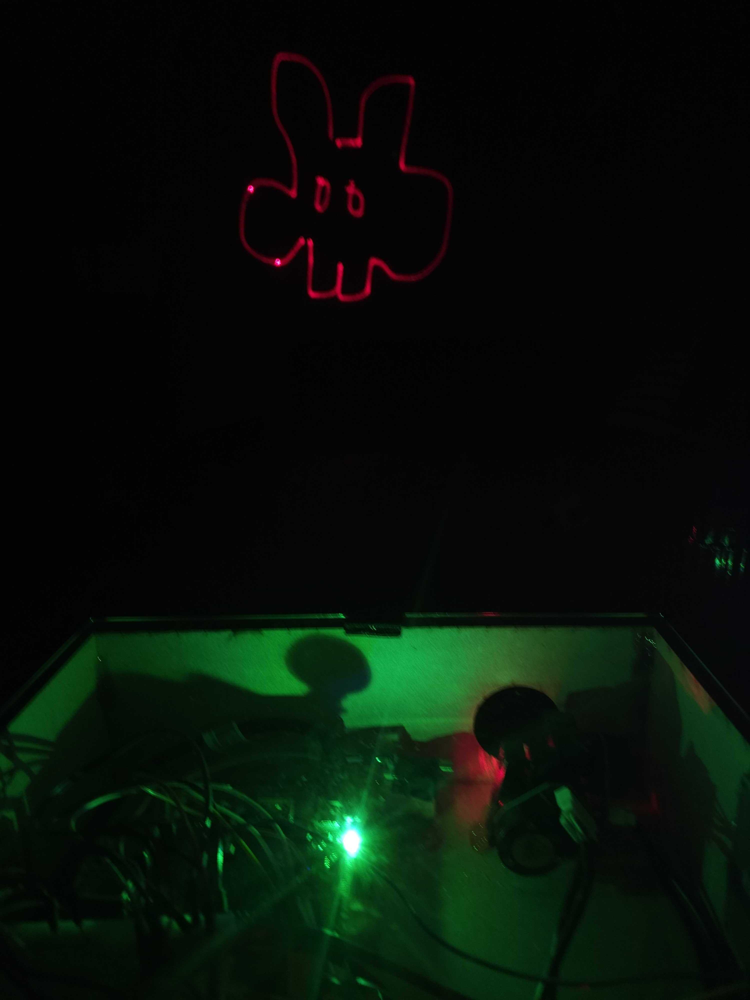

# HoloGlobe

An insanely impractical 3D hologram rotating sphere POV (persistence of vision)




## What does it do?

It spins a frame mount of programmable leds and updates insanely fast so that an image
is formed on a spherical shape. Due to the persistent nature of the eye, this is perceived
by the viewer as a floating semi-transparent image.

## How is it done?

Mainly 3d-print and lasercut, an RC speedboat engine and some rough electronics.
The spinning frame is made by two programmable led strips handled by a Raspberry PI

## What can it show?

Spherical shapes mapped out on a 50x100 matrix, globes, death stars, heads, whatever.
Image upload system is in progress...


## Is it dangerous?

Yes, it may actually burn up. That's why it needs to be contained.

## Other noteworthy projects




## Prerequisites

Raspbian install RPI3b+

libgpiod ssd1306 fastled (or similar)

sudo apt install gpiod libgpiod-dev

## build gpiod.zig module from c

    g++ -Wall -Wextra -Werror test.c -lgpiod
    zig cc test.c -lgpiod
    zig translate-c test.c -lgpiod > gpiod.zig

## build ws281x.zig Raspberry pi ws281x library to zig

    git clone https://github.com/jgarff/rpi_ws281x.git
    cmake -B build .
    zig  translate-c -lc -Ibuild ws2811.c > ws2811.zig

## libgpiod access for user

    sudo usermod -a -G dialout <username>
    echo 'SUBSYSTEM=="gpio", KERNEL=="gpiochip[0-9]*", GROUP="dialout", MODE="0660"' | sudo tee /etc/udev/rules.d/60-gpiod.rules
    sudo udevadm control --reload-rules
    sudo udevadm trigger --verbose

## spidev access for user

    echo 'KERNEL=="spidev*", GROUP="dialout", MODE="0660"' | sudo tee /etc/udev/rules.d/60-spidev.rules
    sudo udevadm control --reload-rules
    sudo udevadm trigger --verbose

## RPI3 pinout
## Timing (Manual)

is the crux of programmable led control
The WS2812B is controlled by one single data line and bytes are sent as bits in 1.25us pulses

    0 bit: 0.40us HI, 0.85us LO
    1 bit: 0.80us HI, 0.45us LO

This needs to match the cpu freq of the controller
For raspberry pi it can be found 1 500 000 000

    cat /sys/devices/system/cpu/cpu0/cpufreq/scaling_cur_freq
    vcgencmd measure_clock arm

we cannot rely software timing so we need to base sleep on inline assembly
1MHz = 1000000 clock cycles per second = 1 cycle / us
800Mhz = 800 000 cycles / ns

## ARMv7 Raspberry PI or Rock PI

### USE PWM and DMA for stable timing

add missing pwm overlay
```
cat <<'EOF' > rockchip-pwm-gpio.dts
/dts-v1/;

/ {
        compatible = "rockchip,rk3399";

        fragment@0 {
                target-path = "/aliases";
                __overlay__ {
                        pwm0 = "/pwm@ff420000";
                        pwm1 = "/pwm@ff420010";
                };
        };

        fragment@1 {
                target-path = "/pwm@ff420000";
                __overlay__ {
                        status = "okay";
                };
        };

        fragment@2 {
                target-path = "/pwm@ff420010";
                __overlay__ {
                        status = "okay";
                };
        };

};
EOF
```

    dtc -O dtb -o rockchip-rk3399-pwm-gpio.dtbo -b 0 -@ rockchip-pwm-gpio.dts
    sudo cp rockchip-rk3399-pwm-gpio.dtbo /boot/dtb/rockchip/overlay/

### DMA

*BASE* ff6d0000

disable audio kernel module if timing is a problem

cat <<EOF | sudo tee /etc/modprobe.d/snd-blacklist.conf
blacklist snd_bcm2835
EOF

sudo nano /boot/config.txt
dtparam=audio=on
sed -i "_#dtparam=spi=on_dtparam=spi=on_" /boot/config.txt

    /boot/armbianEnv.txt:
```
verbosity=1
bootlogo=false
console=both
overlay_prefix=rockchip
fdtfile=rockchip/rk3399-rock-pi-4b.dtb
#fdtfile=rockchip/rk3399-rock-4se.dtb
rootdev=UUID=3e394505-187b-4813-b13f-692a4f1ab875
rootfstype=ext4
overlays=rk3399-spi-spidev rk3399-pwm-gpio
param_spidev_spi_bus=1
usbstoragequirks=0x2537:0x1066:u,0x2537:0x1068:u

### Test program

sudo apt install python3-pip build-essential libpython3-dev
sudo mv /usr/lib/python3.11/EXTERNALLY-MANAGED /usr/lib/python3.11/EXTERNALLY-MANAGED.old
sudo pip3 install rpi_ws281x adafruit-circuitpython-neopixel
sudo pip3 install --upgrade adafruit-python-shell click
sudo apt install python3-libgpiod

```
cat <<'EOF' | tee test-led.py
import time
import board
import neopixel
# Choose an open pin connected to the Data In of the NeoPixel strip, i.e. board.D18
# NeoPixels must be connected to D10, D12, D18 or D21 to work.
pixel_pin = board.D18
# The number of NeoPixels
num_pixels = 3
# The order of the pixel colors - RGB or GRB. Some NeoPixels have red and green reversed!
# For RGBW NeoPixels, simply change the ORDER to RGBW or GRBW.
ORDER = neopixel.GRB
EOF
```

### Image generation

create 50x100 24bit png:

    convert paels-bw.jpeg -resize 100x50! test3.png

create bytecode img.zig (step to be removed later on)

    python3 scripts/img2zig.py <input>
    mv img.zig src

now build:

    zig build
