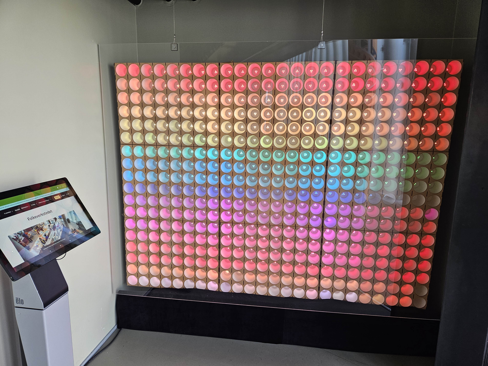

# Ledwall

A large (2x3m) neopixel wall of 24x18 paper cups with backmounted programmable leds

## What can it do?

It can show pixelated images, animations, letters, perhaps some game

## How is it done?

Mainly lasercut frames holding paper coffee cups.
Controlled by a Raspberry PI

## What can it show?

Images of 24x18 pixels in all RGB colour. a simple web backend to draw or upload images
that can be sent and shown in led wall

## I want to try!

clone this repo and continue to [Installation](docs/Installation.md)
and  [Documentation](docs/Documentation.md)

## Prerequisites

* Raspberry with installed Raspbian Bookworm (RPI3b+ or newer 64bit)
* lasercutter access
* coding skills

[more info](docs/Prerequisites.md)
